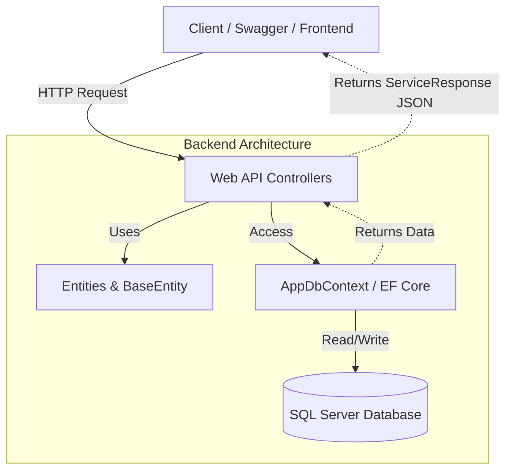

E-Commerce API (Shoe Store Project) 

Bu proje, Yazılım Mimarileri ve Uygulama Geliştirme dersi kapsamında geliştirilmiş, ayakkabı satışı üzerine kurgulanmış kapsamlı bir RESTful Web API projesidir. Modern yazılım mimarisi prensiplerine uygun olarak, .NET ve Entity Framework Core teknolojileri kullanılarak geliştirilmiştir. 

1. Proje Açıklaması 

Bu API, bir e-ticaret platformunun backend ihtiyaçlarını karşılamak üzere tasarlanmıştır. Müşterilerin ürünleri inceleyebileceği, kategorilere göz atabileceği ve sipariş oluşturabileceği bir altyapı sunar. 

Öne Çıkan Özellikler: 

Generic Response Wrapper: Tüm API dönüşleri standart bir formatta (ServiceResponse<T>) sunulur. 

BaseEntity Mimarisi:Kod tekrarını önlemek (DRY Prensibi) amacıyla tüm veritabanı nesneleri ortak bir atadan türetilmiştir (CreatedAt, UpdatedAt, IsDeleted). 

Data Seeding: Proje ilk ayağa kalktığında veritabanına otomatik olarak örnek veriler (Nike, Adidas vb.) eklenir. 

Soft Delete: Veriler veritabanından kalıcı olarak silinmez, sadece IsDeleted işareti ile pasife alınır. 

Kullanılan Teknolojiler: 

ASP.NET 9.0 (Core) 

RESTful Web API

Entity Framework Core (Code First) 

SQL Server 

LINQ 

Swagger UI
 

2. Mimari Diyagram 

Proje, katmanlı mimari prensiplerini ve Separation of Concerns (İlgi Alanlarının Ayrımı) ilkesini benimser. Aşağıdaki diyagram veri akışını özetlemektedir: 


 

 3. Endpoint Listesi 
API, kaynaklara erişim için standart HTTP metodlarını kullanır.

###  Products (Ürünler)
| Metot | URL | Açıklama |
| :--- | :--- | :--- |
| `GET` | `/api/products` | Tüm aktif ürünleri listeler. |
| `GET` | `/api/products/{id}` | ID'ye göre tek bir ürün getirir. |
| `POST` | `/api/products` | Yeni bir ürün ekler. |
| `PUT` | `/api/products/{id}` | Mevcut ürünü günceller. |
| `DELETE` | `/api/products/{id}` | Ürünü siler (Soft Delete). |

###  Categories (Kategoriler)
| Metot | URL | Açıklama |
| :--- | :--- | :--- |
| `GET` | `/api/categories` | Tüm kategorileri listeler. |
| `POST` | `/api/categories` | Yeni kategori oluşturur. |

###  Users (Kullanıcılar)
| Metot | URL | Açıklama |
| :--- | :--- | :--- |
| `GET` | `/api/users` | Tüm kullanıcıları listeler. |
| `GET` | `/api/users/{id}` | ID'ye göre kullanıcı detayını getirir. |
| `POST` | `/api/users` | Yeni kullanıcı kaydı oluşturur. |

###  Orders (Siparişler)
| Metot | URL | Açıklama |
| :--- | :--- | :--- |
| `GET` | `/api/orders` | Tüm siparişleri listeler. |
| `GET` | `/api/orders/{id}` | Belirli bir siparişin detaylarını getirir. |
| `POST` | `/api/orders` | Yeni bir sipariş oluşturur. |
 
 

 4. API Response Örnekleri 

Proje, istemciye (Frontend) her zaman tutarlı bir cevap dönmek için Generic Wrapper yapısı kullanır. 

Başarılı İstek Örneği (200 OK): 
JSON

```json
{
  "data": [
    {
      "id": 1,
      "name": "Nike Air Zoom",
      "price": 3500.00,
      "stock": 10,
      "category": "Running Shoes"
    }
  ],
  "success": true,
  "message": "Ürünler başarıyla listelendi."
}
``` 
Hatalı İstek Örneği (404 Not Found): 
JSON 
```json
{ 
  "data": null, 
  "success": false, 
  "message": "Aradığınız ürün bulunamadı." 
} 
``` 

 5. Kurulum Talimatları 

Projeyi yerel makinenizde çalıştırmak için aşağıdaki adımları izleyin: 

Adım 1: Projeyi Klonlayın
```bash
git clone https://github.com/BeyzaBsrn/ECommerceAPI.git 
```
Proje klasörüne girin:
```bash 
cd ECommerceAPI  
 ```
Adım 2: Veritabanı Bağlantısını Ayarlayın 
appsettings.json dosyasındaki ConnectionStrings alanının kendi SQL Server ayarlarınıza uygun olduğundan emin olun. 

Adım 3: Veritabanını Oluşturun 
Terminali açın ve veritabanını oluşturmak (ve seed dataları yüklemek) için şu komutu çalıştırın: 
```bash
dotnet ef database update
```
(Bu işlem veritabanını oluşturacak ve Nike, Adidas gibi örnek verileri otomatik ekleyecektir.) 

Adım 4: Projeyi Başlatın
```bash
dotnet run
```
Proje ayağa kalktığında terminalde Now listening on: http://localhost:5020 ibaresini göreceksiniz.
Tarayıcınızda http://localhost:5020/swagger adresine giderek Swagger arayüzü üzerinden API'yi test edebilirsiniz. 

Geliştirici: Beyza Başaran 

Tarih: Ocak 2026 

 
